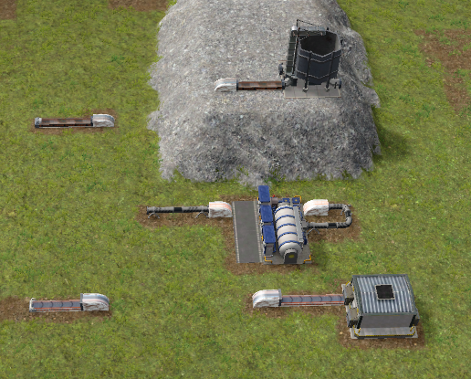

## This is a Captain Of Industry Mod that adds underground transport into the game.

It adds entrances for Flat, Loose and Pipe underground trajectory.

This mod is based on/compatible with Captain Of Industry Update3

# Installation
Extract the included folder in the .ZIP to '%appdata%/Captain of Industry/Mods'. When creating a new game, you will be prompted to select which mods to use.

This Mod can be used in new and existing games.

Due to the limited Mod options (yet) in the game, once the mod is used in a game (save), it is not possible to remove it again.

# Usage

Research "Underground Transport", this is behing ConveyorT2

When the research is unlocked, the three Entrances are available in the "Transports" toolbar.

Place the Entrances on the map, instances of the same type will autoconnect when placed correctly and within limits.

Initially the Entrance is dual Input/Output.
The Input/Output status gets fixed when a transport/building/storage is connected to the Entrance.

When selecting the Entrance, the connection and status is shown.

When Entrances are not connected and a valid one to connect is available, you can use the "Connect button" in the UI

The connection is valid when : 

- Entrances are of the same type

- The horizontal distance is 70 or less

- The vertical distance is 30 or less.

The Underground Transport uses the speed of the in and outgoing ports.
The time it takes for the products to travel thru the underground traject is identical to a Level 3 Conveyor/Pipe
